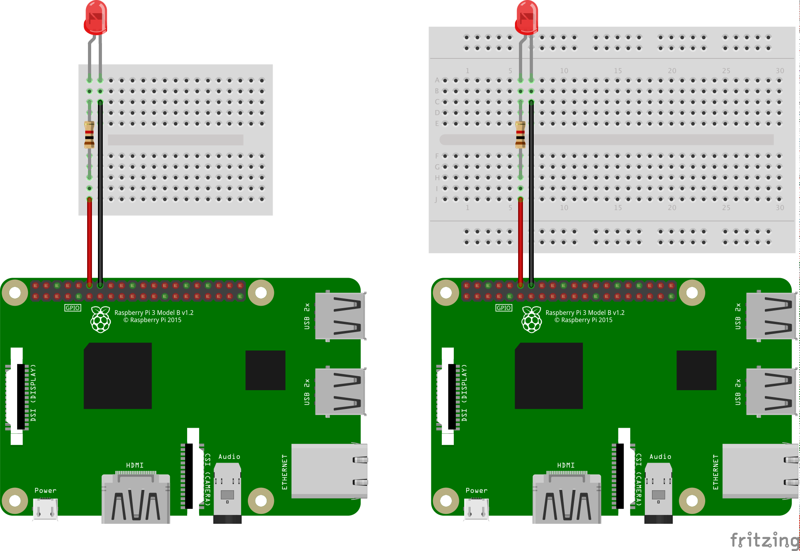
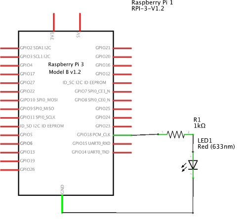
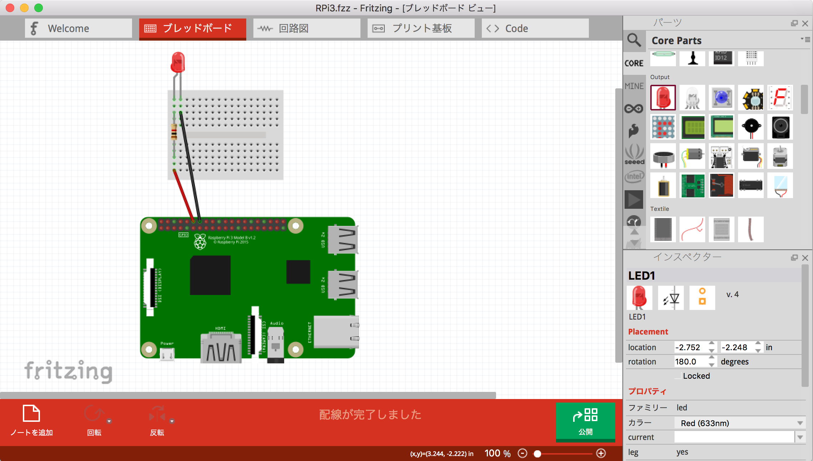

# LEDを光らせる

## 回路の作成
### 必要なもの

* LED
* 抵抗(1KΩ)
* ブレッドボード
* ジャンパワイヤー(メスオス) 2本

### ブレッドボード配線図

配線図の通りに配線していきます。

 

1. 配線図と同じ向きにRaspberry Piとブレッドボードを並べます。
2. LEDをブレッドボードに差し込みます。足の長い方を左側、短い方を右側に差し込みます。
3. 抵抗をブレッドボードに差し込みます。向きはどちらでもよいです。
4. 黒のジャンパワイヤーをブレッドボードとRaspberry PiのGPIOコネクタ(上段左から7番目)のGNDに差し込みます。
5. 赤のジャンパワイヤーを同様に、ブレッドボードとRaspberry PiのGPIOコネクタ(上段左から6番目)のGPIO18番ピンに差し込みます。

#### 注意点
* 配線を行う際には、Raspberry Piの電源はOFFにすることを推奨します。
(今回は起動の手間を省くため電源ONのままやってしまいます。間違えないように注意してください。)
* LEDには極性(+/-)があります。足の長い方が＋側(アノード)、足の短い方が−側(カソード)です。
間違えると点灯しません。壊れてしまうこともあります。
* 配線をする際には、マイナス側から作成し、最後にプラス側のピンを接続するようにします。
(回路が完成する前に電流が流れてしまうのを防ぐため)
* 電子工作は水分に非常に弱いです。金属部分が濡れないよう気をつけてください。

### 回路図



上のブレッドボード配線図を回路図にすると、このようになります。
GPIOポートの18番ピンに、抵抗、LEDが接続されています。

## 制御プログラムの作成
### LED点灯プログラム

Pythonを使ってLEDを点灯させるプログラム led_on.py を作成します。

```python
#!/usr/bin/env python

import RPi.GPIO as GPIO    # RPi.GPIOパッケージのインポート
import time

if __name__ == "__main__":

  LED1 = 18    # LED1 --> GPIO1(BCM:18,Physical:12)

  GPIO.setmode(GPIO.BCM)    # BCMのポート番号を使用
  GPIO.setup(LED1, GPIO.OUT)    # GPIO1番を出力に設定

  GPIO.output(LED1, GPIO.HIGH)    # ポートにHighの信号を出力(LEDが点灯します)
  time.sleep(2)

  GPIO.output(LED1, GPIO.LOW)    # ポートにLowの信号を出力(LEDが消灯します)

  GPIO.cleanup()    # GPIOポートの撤収処理
```

led_on.pyを実行してみましょう。ターミナルから以下のように実行します。
```bash
$ python led_on.py
```

* LEDが2秒点灯して終了します。
　

### LED点滅プログラム

次にLEDを点滅させるプログラム led_blink.py を作成します。

```python
#! /usr/bin/env python

import RPi.GPIO as GPIO    # RPi.GPIOパッケージのインポート
import time

if __name__ == ("__main__"):

  LED1 = 18    # LED1 --> GPIO1(BCM:18,Physical:12)

  GPIO.setmode(GPIO.BCM)    # BCMのポート番号を使用
  GPIO.setup(LED1, GPIO.OUT)     # GPIO1番を出力に設定

  try:
    while True:

      # 1秒点滅
      GPIO.output(LED1, GPIO.HIGH)    # ポートにHighの信号を出力(LEDが点灯します)
      time.sleep(1)

      GPIO.output(LED1, GPIO.LOW)    # ポートにLowの信号を出力(LEDが消灯します)
      time.sleep(1)

  # ctrl+c を受け取った場合
  except KeyboardInterrupt:
      print ('key interrupt')

  GPIO.cleanup()    # GPIOポートの撤収処理
```
　
led_blink.pyを実行してみましょう。ターミナルから以下のように実行します。
```bash
$ python led_blink.py
```

* LEDが1秒ごとに点滅します。ctrl+c のキー入力で終了します。
　

### PWMを使ったLEDの明るさ制御
ここまではHigh/Lowの制御のみで、LEDは点灯/消灯のどちらかの状態になっていました。
これをデジタル出力と言います。

一方、アナログ出力(PWM制御)では、LEDの点灯時の明るさを変更することができます。
Raspberry PiのGPIOポートでは、ソフトウェアPWMを使用することができます。

LEDの明るさを変更するプログラム led_pwm.py を作成します。

```python
#! /usr/bin/env python

import RPi.GPIO as GPIO
import time

if __name__ == ("__main__"):

  LED1 = 18    # LED1 --> GPIO1(BCM:18,Physical:12)

  GPIO.setmode(GPIO.BCM)
  GPIO.setup(LED1, GPIO.OUT)
  GPIO.output(LED1, GPIO.LOW)

  p18 = GPIO.PWM(LED1, 100)    # LED1の周波数設定(100Hz)
  p18.start(0)    # デューティ比 0 でPWM出力開始

  try:
    while 1:
      # 0〜100まで10段階でデューティ比を設定(プラス方向)
      for dc in range(0, 100, 10):
        p18.ChangeDutyCycle(dc)
        time.sleep(0.5)

      # 100〜0まで10段階でデューティ日を設定(マイナス方向)
      for dc in range(100, 0, -10):
        p18.ChangeDutyCycle(dc)
        time.sleep(0.5)

  except KeyboardInterrupt:
      print ('key interrupt')

  p18.stop()    # PWM出力を停止

  GPIO.cleanup()
```

led_pwm.pyを実行してみましょう。ターミナルから以下のように実行します。
```bash
$ python led_pwm.py
```

* LEDの明るさが10段階で変化します。ctrl+c のキー入力で終了します。
* 周波数やデューティ比の設定を変更してみましょう。
  * 周波数に100Hzを設定しています。１秒間に100回のHigh/Lowを行います。
  * デューティ比の単位はパーセントです。0〜100の値を指定します。

## 抵抗値の求め方
今回は1kΩの抵抗を使用しましたが、使用するLEDの特性に合わせて抵抗値を算出する必要があります。

_抵抗値の計算式_
> ( 電源電圧[Ｖ] － 順方向電圧降下[Ｖ] ) ÷ 順方向電流[Ａ] ＝ 抵抗値[Ω]

今回使用しているLEDは以下のものです。

5mm赤色LED　ESL-R5A33ARCN114　
http://akizukidenshi.com/catalog/g/gI-08359/

データシート
http://akizukidenshi.com/download/ds/everstar/ESL-R5A33ARCN114.pdf

順方向電圧降下 2.1[V]、標準電流 20[mA] となっています。
実際には、電流は1mA程度流せば光ります。
(20mAを流すと明るすぎて目を痛めるかもしれません。)

電源電圧は3.3Vですので、これらの情報を元に抵抗値を計算します。

> ( 3.3 - 2.1 ) / 0.02 = 60

> ( 3.3 - 2.1 ) / 0.001 = 1200

60〜1200Ω 程度の抵抗を使用すればよいので、
1kΩの抵抗を使用すれば問題ないことがわかります。

抵抗値はそこまで神経質にならなくても大丈夫ですが、抵抗は必ず接続してください。
電流が流れすぎるとLEDが壊れる可能性があります。

秋月電子通商「LED・抵抗の計算式」　
http://akizukidenshi.com/download/led-r-calc.pdf

マルツオンライン「LED基本ガイド」
http://www.marutsu.co.jp/pc/static/large_order/led


## 電子回路図作成ツール Fritzing
ブレッドボード配線図や回路図はFritzingというアプリを使って作成しています。
無料でダウンロードできます。

http://fritzing.org/home/



