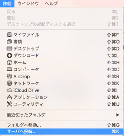
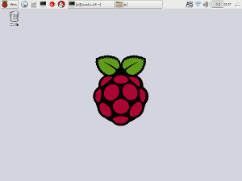

# 事前準備(VNCを使用したリモートアクセスの設定)

Raspberry Pi 3 のリモートアクセス環境の構築手順をまとめました。

PCから、Raspberry Pi 3 のGUIにアクセスできるようにします。

## Raspberry Pi 3 側の作業
### VNCサーバのインストール
すでにRaspberry Piは無線もしくは有線でネットワークに接続されているものとします。

ターミナルを起動し、Raspberry Pi に VNCサーバをインストールします。

```bash
$ sudo apt-get update
$ sudo apt-get install vncserver
```

### MACアドレスの確認
MACアドレスを確認します。
最終的には、Raspberry Pi に割り当てられているIPアドレスが知りたいのですが、そのために、先にMACアドレスを調べておきます。

固定IPアドレスの設定をしている場合は不要です。

ifconfig コマンドを実行して、MACアドレスを確認しておきます。

```bash
$ ifconfig
wlan0     Link encap:イーサネット  ハードウェアアドレス xx:xx:xx:xx:xx:xx
```

無線の場合は wlan0、有線の場合は eth0 のハードウェアアドレスがMACアドレスになります。


## PC側の作業
次に、PC側のVNCクライアントの準備をします。

### Mac の場合
#### IPアドレスの確認
ターミナルを起動し、arpコマンドを実行して、同一ネットワークに接続されているデバイスを確認します。

```bash
$ arp -a
? (192.168.xx.xx) at xx:xx:xx:xx:xx:xx on en0 ifscope [ethernet]
```
先ほど調べたMACアドレスが一致する行がRaspberry Pi の情報になります。

192.168.xx.xx というような値がIPアドレスです。

#### ssh で接続
sshコマンドで、Raspberry Pi にアクセスできることを確認します。

```bash
$ ssh (ユーザ名)@192.168.xx.xx  ← 先ほど確認したIPアドレス
```
パスワードを入力すると、Raspberry Pi にログインできます。
（初期設定は、ユーザ:pi、パスワード:raspberry です。）
　

Raspberry Pi にログインできたら、vncserverコマンドでvncserverを起動します。

初回のみパスワードを聞かれますので、8文字以内で入力します。

ここで設定したパスワードは、後ほどクライアント側からアクセスする際に使用します。

```bash
$ vncserver

(パスワードの設定)

New 'X' desktop is (マシン名):1

Starting applications specified in /home/pi/.vnc/xstartup
Log file is /home/pi/.vnc/(マシン名):1.log
```
Xデスクトップ 1番が起動しました。（もう一度実行すると2番が起動します。）

#### VNCクライアントで接続
Macの場合、VNCクライアントソフトをインストールする必要はありません。

Finder の 移動 メニューから サーバへ接続を選択します。

 

サーバアドレスに以下のように入力します。
```bash
vnc://(Raspberry PiのIPアドレス):(ポート番号 + ディスプレイ番号)
```

例えばこのように入力します。
```bash
vnc://192.168.xx.xx:5901
```

パスワードを聞かれるので入力します。

ここで入力するのは、vncserver コマンド実行時に設定したパスワードになります。

(Raspberry Piのログインパスワードではないので注意！)

Raspberry Pi の画面が表示できました。



### Windows の場合
Windowsの場合は、ターミナルソフトやVNCクライアントソフトが準備されていませんので、インストールする必要があります。

VNCクライアントを使用した接続方法はMacの場合と同様です。

#### ターミナルソフト
Tera Term などがあります。

Tera Term : https://ttssh2.osdn.jp/

#### VNCクライアントソフト
Real VNC や Ultra VNC などがあります。

Real VNC : https://www.realvnc.com/download/viewer/

Ultra VNC : http://www.uvnc.com/downloads/ultravnc.html

## IPアドレスを調べるのに便利なスマートフォンアプリ Fing
スマートフォンアプリ Fing を使って、ネットワークに接続されている機器のIPアドレス、MACアドレスを簡単に調べることができます。

iOS向け 
https://itunes.apple.com/jp/app/fing-network-scanner/id430921107?mt=8

Android向け 
https://play.google.com/store/apps/details?id=com.overlook.android.fing&hl=ja
