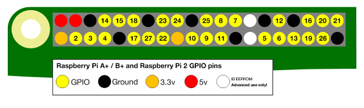
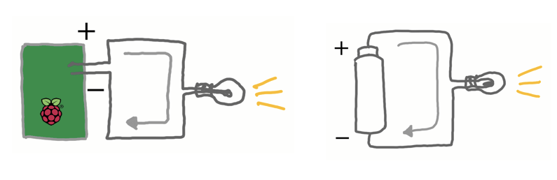
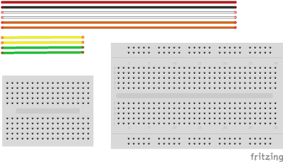
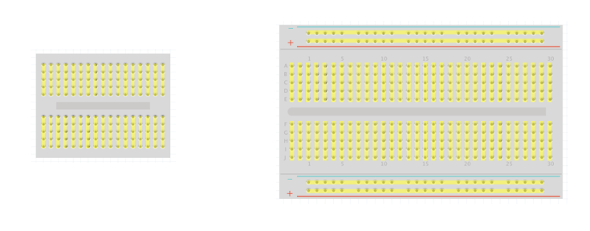
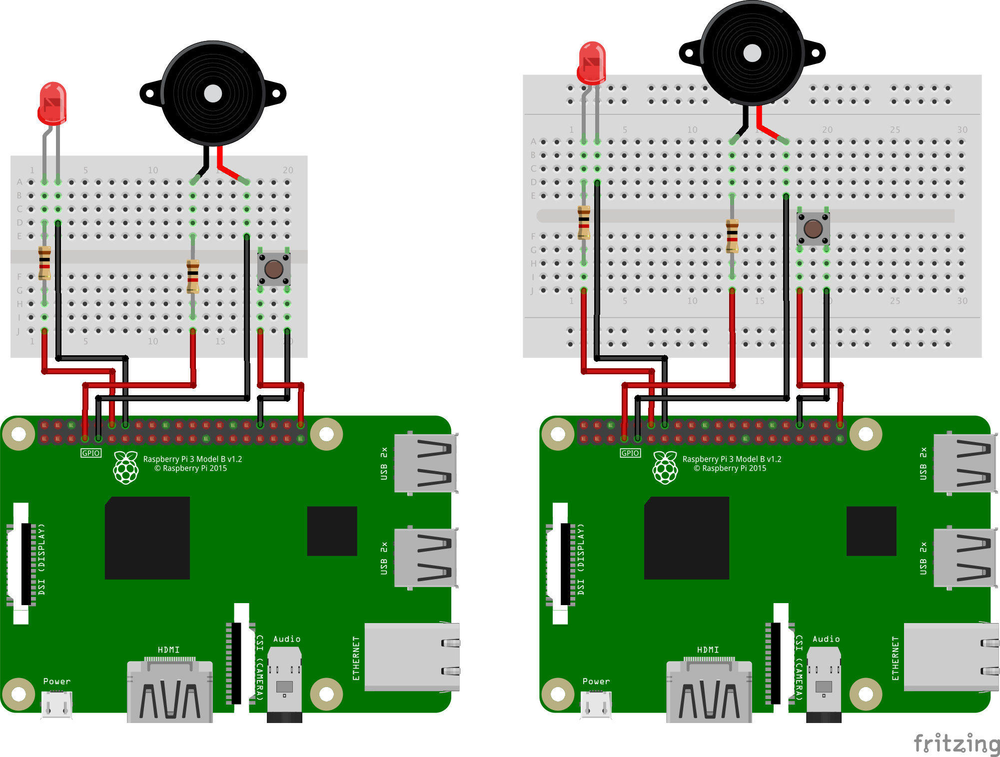
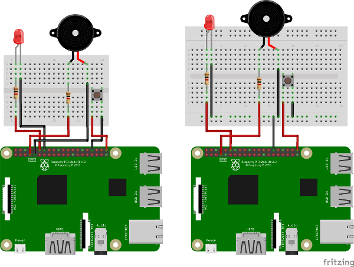

# Raspberry Piを使った電子工作

## Raspberry PiのGPIOポート

Raspberry Piには、40ピンのGPIOポートが搭載されています。
GPIOとは「General Purpose Input/Output」の略です。
汎用入出力ポートとも呼ばれます。

GPIOポートは、Raspberry Piと外界との物理的なインターフェイスになります。
具体的には、GPIOポートにLEDなどの電子部品を接続します。

そして、Raspberry Piから制御プログラムを実行することで、
電子部品を制御することができます。
例えば、LEDのON/OFFなどを制御できます。


## GPIOで使用するポート番号

ポートに割り当てられている番号と名前を調べるコマンドがあります。
ターミナルから gpio readall を実行してみましょう。

```bash
$ gpio readall
 +-----+-----+---------+------+---+---Pi 3---+---+------+---------+-----+-----+
 | BCM | wPi |   Name  | Mode | V | Physical | V | Mode | Name    | wPi | BCM |
 +-----+-----+---------+------+---+----++----+---+------+---------+-----+-----+
 |     |     |    3.3v |      |   |  1 || 2  |   |      | 5v      |     |     |
 |   2 |   8 |   SDA.1 | ALT0 | 1 |  3 || 4  |   |      | 5V      |     |     |
 |   3 |   9 |   SCL.1 | ALT0 | 1 |  5 || 6  |   |      | 0v      |     |     |
 |   4 |   7 | GPIO. 7 |   IN | 1 |  7 || 8  | 1 | ALT5 | TxD     | 15  | 14  |
 |     |     |      0v |      |   |  9 || 10 | 1 | ALT5 | RxD     | 16  | 15  |
 |  17 |   0 | GPIO. 0 |   IN | 0 | 11 || 12 | 0 | IN   | GPIO. 1 | 1   | 18  |
 |  27 |   2 | GPIO. 2 |   IN | 0 | 13 || 14 |   |      | 0v      |     |     |
 |  22 |   3 | GPIO. 3 |   IN | 0 | 15 || 16 | 0 | IN   | GPIO. 4 | 4   | 23  |
 |     |     |    3.3v |      |   | 17 || 18 | 0 | IN   | GPIO. 5 | 5   | 24  |
 |  10 |  12 |    MOSI | ALT0 | 0 | 19 || 20 |   |      | 0v      |     |     |
 |   9 |  13 |    MISO | ALT0 | 0 | 21 || 22 | 0 | IN   | GPIO. 6 | 6   | 25  |
 |  11 |  14 |    SCLK | ALT0 | 0 | 23 || 24 | 1 | OUT  | CE0     | 10  | 8   |
 |     |     |      0v |      |   | 25 || 26 | 1 | OUT  | CE1     | 11  | 7   |
 |   0 |  30 |   SDA.0 |   IN | 1 | 27 || 28 | 1 | IN   | SCL.0   | 31  | 1   |
 |   5 |  21 | GPIO.21 |   IN | 1 | 29 || 30 |   |      | 0v      |     |     |
 |   6 |  22 | GPIO.22 |   IN | 1 | 31 || 32 | 0 | IN   | GPIO.26 | 26  | 12  |
 |  13 |  23 | GPIO.23 |   IN | 0 | 33 || 34 |   |      | 0v      |     |     |
 |  19 |  24 | GPIO.24 |   IN | 0 | 35 || 36 | 0 | IN   | GPIO.27 | 27  | 16  |
 |  26 |  25 | GPIO.25 |   IN | 0 | 37 || 38 | 0 | IN   | GPIO.28 | 28  | 20  |
 |     |     |      0v |      |   | 39 || 40 | 0 | IN   | GPIO.29 | 29  | 21  |
 +-----+-----+---------+------+---+----++----+---+------+---------+-----+-----+
 | BCM | wPi |   Name  | Mode | V | Physical | V | Mode | Name    | wPi | BCM |
 +-----+-----+---------+------+---+---Pi 3---+---+------+---------+-----+-----+
```


項目は以下のようになっています。

 名前 | 内容 |
------------ | -------------
 Physical | 物理ピン番号 |
 BCM | GPIO番号 |
 wPi | WiringPiライブラリ使用時のピン番号 |
 Name | ピンの機能 |
 Mode | デフォルトのMode |
 V | デフォルトの抵抗設定(1:プルアップ、0:プルダウン) |


Physical は、物理ピン番号です。
この番号は、全てのピンに割り当てられています。

BCM は、GPIOポートのピン番号です。
この番号は、GPIO以外のポート(5V,3.3V,0V)には割り当てられていません。

wPi は、WiringPiライブラリ使用時のピン番号です。
この番号も、GPIO以外のポート(5V,3.3V,0V)には割り当てられていません。

今回のハンズオンでは、BCM番号を使用していきます。



公式ドキュメントより https://www.raspberrypi.org/documentation/usage/gpio-plus-and-raspi2/README.md

## ピンの使い方

40ピンのうち、GPIOとして使えるのは28ピンです。GPIOで制御できるピンに
LEDなどの電子部品を接続します。GPIOのピンの動作電圧は3.3Vです。プラス側に接続します。

5V,3.3Vのピンは常時電流が流れるピンとなっていて、制御はできません。プラス側に接続します。

0Vのピンは、GND(グランド)と言います。マイナス側に接続します。


## 回路の作り方

GPIOポートのピンと電子部品を接続して回路を作成します。
Raspberry Piを電源として、プラス側からマイナス側に電流が流れるように作成します。
乾電池を使って豆電球を光らせる場合と比較すると以下のようなイメージです。



また、一般的にピンと部品の接続には、ジャンパワイヤーとブレッドボードを使います。



ブレッドボードの内部は、以下のように電気的につながっています。



ブレッドボードには、ミニブレッドボードと通常のブレッドボードの2種類があります。
2種類のブレッドボードの違いは、通常のブレッドボードには上下2列に＋と−の列があることです。
これらを使うと、よりわかりやすく配線をすることができます。

## 配線をしてみよう
今回のハンズオンでは、LED(赤色)、スイッチ、圧電サウンダ(ブザー)の3つを接続します。
以下の配線図の通りに接続してみましょう。




### 必要なもの
* LED
* スイッチ
* 圧電サウンダ
* 抵抗(1KΩ) 2本
* ブレッドボード
* ジャンパワイヤー(メスオス) 6本

### LEDの配線
1. 配線図と同じ向きにRaspberry Piとブレッドボードを並べます。
2. LEDをブレッドボードに差し込みます。足の長い方を左側、短い方を右側に差し込みます。
3. 抵抗をブレッドボードに差し込みます。向きはどちらでもよいです。
4. ジャンパワイヤーをブレッドボードとRaspberry PiのGPIOコネクタの上段左から7番目、GNDに差し込みます。(物理ピン番号14番)
5. ジャンパワイヤーをブレッドボードとRaspberry PiのGPIOコネクタの上段左から6番目、GPIO18番ピンに差し込みます。(物理ピン番号12番)

### スイッチの配線
1. スイッチをブレッドボードに差し込みます。
2. ジャンパワイヤーをブレッドボードとRaspberry PiのGPIOコネクタの上段右から4番目、GNDに差し込みます。(物理ピン番号34番)
3. ジャンパワイヤーをブレッドボードとRaspberry PiのGPIOコネクタの上段1番右、GPIO21番ピンに差し込みます。(物理ピン番号40番)

### 圧電サウンダの配線
1. 圧電サウンダをブレッドボードに差し込みます。
2. 抵抗をブレッドボードに差し込みます。向きはどちらでもよいです。
3. ジャンパワイヤーをブレッドボードとRaspberry PiのGPIOコネクタ(下段左から5番目)のGNDに差し込みます。(物理ピン番号9番)
4. ジャンパワイヤーを同様に、ブレッドボードとRaspberry PiのGPIOコネクタ(下段左から4番目)のGPIO4番ピンに差し込みます。(物理ピン番号7番)

### 注意点
* 配線を行う際には、Raspberry Piの電源はOFFにすることを推奨します。
(今回は起動の手間を省くため電源ONのままやってしまいます。間違えないように注意してください。)
* LEDには極性(+/-)があります。足の長い方が＋側(アノード)、足の短い方が−側(カソード)です。
間違えると点灯しません。壊れてしまうこともあります。
* 圧電サウンダには極性はありません。抵抗はプラス側に接続してください。
* 配線をする際には、マイナス側から作成し、最後にプラス側のピンを接続するようにします。
(回路が完成する前に電流が流れてしまうのを防ぐため)
* 電子工作は水分に非常に弱いです。金属部分が濡れないよう気をつけてください。  

# Appendix
## ミニブレッドボードと通常のブレッドボードの違い
下の2つの配線図は、同じ配線になります。
+/- の列を持った通常のブレッドボードの利点がわかりましたでしょうか？



## 電子工作部品の購入について
電子工作部品の購入場所ですが、私は秋葉原の秋月電子通商で購入することが多いです。

秋月電子通商
http://akizukidenshi.com/catalog/top.aspx

Amazonでも、初心者向けセットが色々売っています。

何回か購入したことがありますが、意外と抜け漏れがあったので、店頭で購入する方が確実かもしれません。


## 電子回路図作成ツール Fritzing
ブレッドボード配線図や回路図はFritzingというアプリを使って作成しています。
無料でダウンロードできます。

http://fritzing.org/home/
