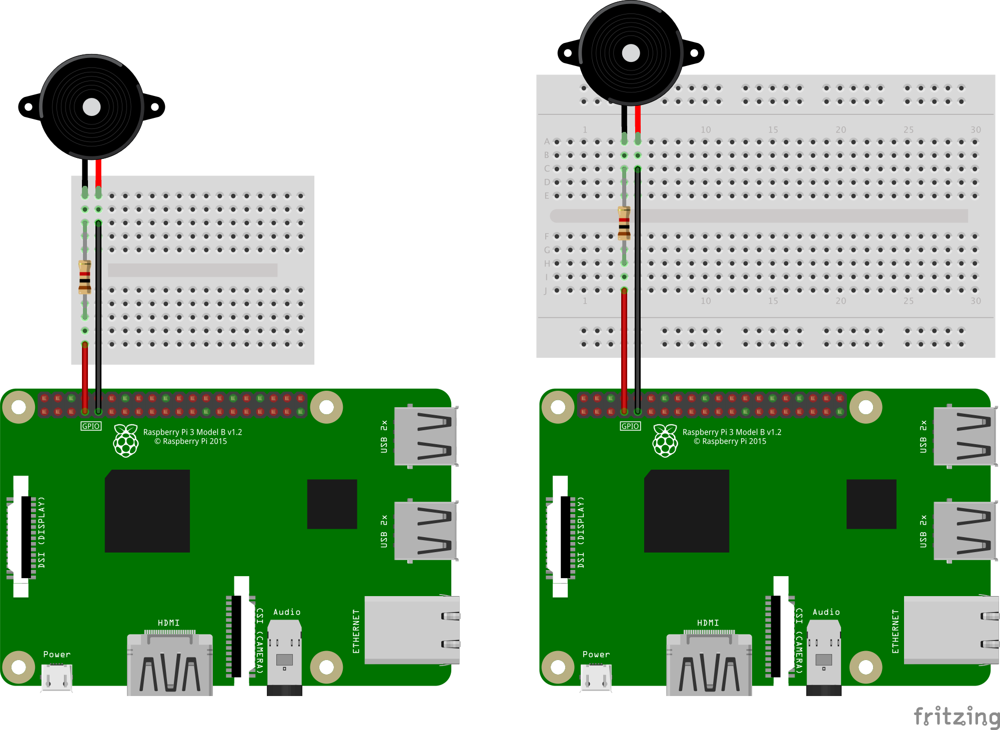

# 圧電サウンダ(ブザー)で音を出す

## 回路の作成
### 必要なもの

* 圧電サウンダ
* 抵抗(1KΩ)
* ブレッドボード
* ジャンパワイヤー(メスオス) 2本

### ブレッドボード配線図

配線図の通りに配線していきます。

 

1. 配線図と同じ向きにRaspberry Piとブレッドボードを並べます。
2. 圧電サウンダをブレッドボードに差し込みます。
3. 抵抗をブレッドボードに差し込みます。向きはどちらでもよいです。
4. 黒のジャンパワイヤーをブレッドボードとRaspberry PiのGPIOコネクタ(下段左から5番目)のGNDに差し込みます。
5. 赤のジャンパワイヤーを同様に、ブレッドボードとRaspberry PiのGPIOコネクタ(下段左から4番目)のGPIO7番ピンに差し込みます。

#### 注意点
* LEDと違い、圧電サウンダには極性はありません。
* 抵抗はプラス側に接続してください。

## 制御プログラムの作成
### ラの音を出力するプログラム

圧電サウンダを使って音を出すプログラム buzzer.py を作成します。

```python
#! /usr/bin/env python

import RPi.GPIO as GPIO
import time

if __name__ == ("__main__"):

  BZ1 = 4    # BZ1 --> GPIO7

  GPIO.setmode(GPIO.BCM)    # BCMのポート番号を使用
  GPIO.setup(BZ1, GPIO.OUT)    # GPIO7番を出力に設定
  buzzer = GPIO.PWM(BZ1, 440)    # BZ1の周波数設定(440Hz)

  buzzer.start(50)    # デューティ比 50 でPWM出力開始

  time.sleep(1)

  buzzer.stop()    # PWM出力を停止

  GPIO.cleanup()    # GPIOポートの撤収処理
```

buzzer.pyを実行してみましょう。ターミナルから以下のように実行します。
```bash
$ python buzzer.py
```

* ブザー音が1秒鳴り、終了します。
* ここでは、440Hzの音を1秒間出力しています。440Hzはラの音です。

### 音階を出力するプログラム

次に、音階を出力するプログラム octave.py を作成します。

```python
#! /usr/bin/env python

import time
import RPi.GPIO as GPIO

if __name__ == ("__main__"):

  BZ1 = 4    # BZ1 --> GPIO7
  GPIO.setmode(GPIO.BCM)    # BCMのポート番号を使用
  GPIO.setup(BZ1, GPIO.OUT)    # GPIO7番を出力に設定

  tonename = ['A', 'A#', 'B', 'C', 'C#', 'D', 'D#', 'E', 'F', 'F#', 'G', 'G#']

  freq = 220.0    # 220Hz(低いラの音)
  buzzer = GPIO.PWM(BZ1, freq)
  buzzer.start(50)    # デューティ比 50 でPWM出力開始

  for i in range(0, 13):
    freq = 220.0 * (2 ** (i/12.0))
    print '%2s : %.1f Hz' % (tonename[i%12], freq)
    buzzer.ChangeFrequency(freq)    # 周波数を変更
    time.sleep(0.2)

  buzzer.stop()
  GPIO.cleanup()
```

octave.pyを実行してみましょう。ターミナルから以下のように実行します。
```bash
$ python octave.py
```
* ブザー音が1オクターブ分鳴り、終了します。
