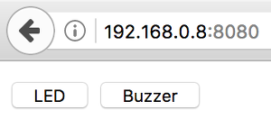
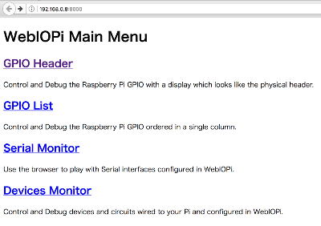
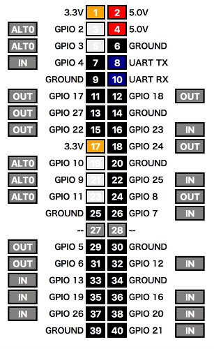
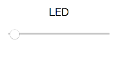

# ブラウザから操作してみよう
LEDやブザーをプログラムから操作できるようになりました。

最後に、Python の WebOb モジュールを使用し、Webブラウザから操作できるようにします。

## WebOb のインストール
WebObモジュールをインストールします。

ターミナルに以下のように入力します。

```bash
$ sudo pip install WebOb
```

### WebOb の公式サイト
WebOb 
http://webob.org/

## Webブラウザから操作するためのプログラム

Webブラウザから操作するためのプログラム webapp.py を作成します。

先に作成した led_on.py と sound_buzzer.py を使用しますので、
同じ階層(ディレクトリ)で作成してください。

```bash
$ vi webapp.py
```

```Python
#!/usr/bin/env python
# coding:utf-8

import time
import RPi.GPIO as GPIO
from webob import Request, Response
from wsgiref.simple_server import make_server
import led_on, sound_buzzer

# Web画面
html = """
<form method="post">
<input type="submit" name="button" value="LED">
<input type="submit" name="button" value="Buzzer">
</form>
"""

# WebAppクラス
class WebApp(object):
  def __call__(self, environ, start_response):
    global html
    global resp
    req = Request(environ)
    if req.path == '/':
      button = req.params.get('button', '')
      resp = Response(html)
      # LEDボタン押下時の処理
      if button == 'LED':
        led_on.led_on()
      # Buzzerボタン押下時の処理
      elif button == 'Buzzer':
        sound_buzzer.buzzer()

    return resp(environ, start_response)

if __name__ == "__main__":
  application = WebApp()

  # 8080番ポートを使用する
  port = 8080
  httpd = make_server('', port, application)
  print 'Serving HTTP on port %d' % port

  try:
    httpd.serve_forever()
  except KeyboardInterrupt:
    print 'Key Interrupt'
```

webapp.py を実行してみましょう。ターミナルから以下のように実行します。
```bash
$ python webapp.py
```

以下のメッセージが出力され、Webサーバが開始されます。
```
Serving HTTP on port 8080
```

PCのブラウザから、Raspberry Pi の 8080番ポートにアクセスしてみましょう。
```
http://(Raspberry Pi の IPアドレス):8080
```

LED と Buzzer のボタンが見えています。(IPアドレスは環境によって変わります。)



* LEDボタンを押下すると、LEDが2秒間点灯します。
* Buzzerボタンを押下すると、Buzzerが2秒間鳴ります。

スマートフォンをお持ちの方は、スマートフォンからも接続してみましょう。(Raspberry Piと同じネットワークに接続してください。)

プログラムを終了する時は、webapp.py のプログラムを実行しているターミナルで、Ctrl + c を入力します。


# おまけ(早く終わった人向け)
WebOb の他にも、Webから Raspberry Pi を操作するためのフレームワークが提供されています。
中でも、WebIOPi というフレームワークが最もメジャーなようです。
(扱い方に少し癖があったので、紹介だけしておきます。)

## WebIOPi のインストール

WebIOPi 公式サイト 
http://webiopi.trouch.com/

ターミナルから以下のように入力して、WebIOPi-0.7.1.tar.gz を取得します。
```bash
$ wget https://sourceforge.net/projects/webiopi/files/WebIOPi-0.7.1.tar.gz
```

展開します。
```bash
$ tar xvzf WebIOPi-0.7.1.tar.gz
```

展開されたディレクトリに移動します。
```bash
$ cd WebIOPi-0.7.1
```

このソースコードは、旧型のRaspberry Pi向けなので、Raspberry Pi 2以降(40ピンのタイプ)を使用する場合はパッチを当てる必要があります。

以下のようにして、パッチをインストールし、実行します。
```bash
$ wget https://raw.githubusercontent.com/doublebind/raspi/master/webiopi-pi2bplus.patch
$ patch -p1 -i webiopi-pi2bplus.patch
```

セットアップをします。
```bash
$ sudo ./setup.sh
```
最後に、インターネットに接続するか？と聞かれるので、n を選択します。

さらに、WebIOPiをサービスとして動かすための仕組みを整えます。
```bash
$ cd /etc/systemd/system/
$ sudo wget https://raw.githubusercontent.com/doublebind/raspi/master/webiopi.service
```

全て終わったら、Raspberry Pi を再起動します。
```bash
$ sudo reboot
```

準備が整いました。

## WebIOPi の開始、終了(デフォルトのプログラム)

まずは、WebIOPi に準備されているプログラムで動作させます。

WebIOPi の開始
```bash
$ sudo systemctl start webiopi
```

デフォルトでは、8000番ポートにアクセスするようになっています。
ブラウザから、Raspberry Pi の 8000番ポートにアクセスしてみましょう。
```
http://(Raspberry Pi の IPアドレス):8000
```

このような画面が見えています。(IPアドレスは環境によって変わります。)



GPIO Header ページに移動します。GPIOポートの画面が表示されます。



12番のGPIO 18番ポートにLEDが接続されているので、右側のグレーの設定をクリックして「OUT」にし、
左側の「12」をクリックして、LEDのON/OFFができることを確認しましょう。


確認が終わったら、WebIOPi を終了させます。

WebIOPi の終了
```bash
$ sudo systemctl stop webiopi
```

## WebIOPi 自作プログラムの実行

WebIOPi では準備されているサンプルの他に、自作のプログラムを動作させることもできます。

### 自作プログラムの準備

GPIO 18番に接続されている LED を ブラウザ上のスライダで、PWM制御させるプログラムを作成します。

まず、sample/led.py を作成します。
```bash
$ mkdir sample
$ vi sample/led.py
```

```Python
#!/usr/bin/env python
# coding:utf-8

import webiopi

GPIO = webiopi.GPIO
RED   = 18

def setup():
    # GPIOをPWMに設定
    GPIO.setFunction(RED  , GPIO.PWM)

def destroy():
   # 消灯
    GPIO.pwmWrite(RED  , 0)
```

次に、sample.index.html を作成します。
```bash
$ vi sample/index.html
```

```HTML
<!DOCTYPE html PUBLIC "-//W3C//DTD HTML 4.01 Transitional//EN" "http://www.w3.org/TR/html4/loose.dtd">
<html>
<head>
    <meta http-equiv="Content-Type" content="text/html; charset=UTF-8">
    <meta name="viewport" content = "height = device-height, width = 420, user-scalable = no" />
    <title>WebIOPi | Demo</title>
    <script type="text/javascript" src="/webiopi.js"></script>
    <script type="text/javascript">
    webiopi().ready(function() {
        var parts;
        // LED
        parts = webiopi().createRatioSlider(18);
        $("#red").append(parts);
        //初期値を指定
        $("#ratio18").val(0);
    });
    </script>
    <style type="text/css">
        input[type="range"] {
            display: block;
            width: 160px;
            height: 45px;
        }   
    </style>
</head>
<body>
<div id="content" align="center">
    <div id="red"><label>LED</label></div>
</div>
</body>
</html>
```

### 自作プログラム実行のための設定変更

/etc/webiopi/config の設定を変更します。
```bash
$ sudo /etc/webiopi/config
```

config ファイル内の、myscript と doc-root を作成したファイル名のパスに置き換えます。

myscriptはファイル名まで、doc-root は index.html のあるディレクトリ名までなので注意してください。

```bash
[SCRIPTS]
# Load custom scripts syntax :
# name = sourcefile
#   each sourcefile may have setup, loop and destroy functions and macros
#myscript = /home/pi/webiopi/examples/scripts/macros/script.py
myscript = /home/pi/WebIOPi-0.7.1/sample/led.py
# ↑ スクリプトファイル名をフルパスで指定

[HTTP]
# HTTP Server configuration
enabled = true
port = 8000
(略)
# Use doc-root to change default HTML and resource files location
#doc-root = /home/pi/webiopi/examples/scripts/macros
doc-root = /home/pi/WebIOPi-0.7.1/sample
# ↑ index.html のあるディレクトリ名をフルパスで指定
```

### 自作プログラムの実行

準備が整いましたので、実行してみます。実行方法はデフォルトのプログラムと同じです。

WebIOPi の開始
```bash
$ sudo systemctl start webiopi
```

ブラウザから、Raspberry Pi の 8000番ポートにアクセスしてみましょう。
```
http://(Raspberry Pi の IPアドレス):8000
```

LEDを操作するスライダが見えています。



* スライダを左から右に動作させると、連動してLEDの明るさが変わります。
  * 多少のタイムラグがあります。